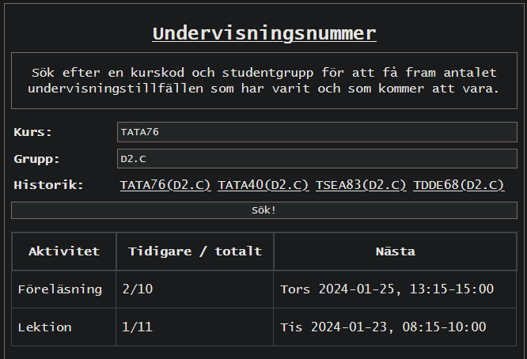

# Undervisningsnummer
Se hur många föreläsningar/lektioner/laborationer osv. som har passerat i en kurs på Linköpings Universitet!

## Länk
[un.samake.se](https://un.samake.se)

## Exempel
Kursen TATA76, tillhör studentgruppen D2.C.
