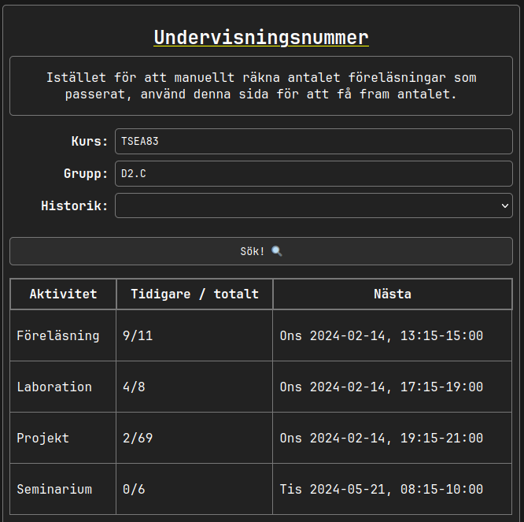

# Undervisningsnummer

Webbapplikation för att se antalet föreläsningar, lektioner, etc som har passerat i en kurs på Linköping universitet.

## Exempelanvändning

Jag läser kursen Datorkonstruktion, TSEA83, och vill veta hur många föreläsningar jag har missat. 

1. Gå till [un.samake.se](https://un.samake.se)
2. Skriv in kurskoden TSEA83. 
3. Jag ser att den senaste föreläsningen var föreläsning 9, och nästa föreläsning är på onsdag.

## Teknisk information

Hemsidans design är rent HTML och CSS. Funktionaliteten drivs av en (krånglig?) kombination av backend-skript på [Lysator](https://www.lysator.liu.se)s server, och frontend-skript i JavaScript.

Backend-skriptet `fetch_object_id.py` omvandlar en fritextsökning på kurskod till deras proprietära "object-id"-format från [TimeEdit](https://cloud.timeedit.net/liu/web/schema/ri1Q7.html). Frontend-skriptet använder sig av detta object-id för att hämta schemainformation från TimeEdit, och räkna ut hur många föreläsningar som har passerat.

## Utveckla lokalt

1. Klona detta repository
2. Gå in i katalogen `local-server`
3. Kör `go run .`
4. Öppna <http://localhost:3000> i din webbläsare.
